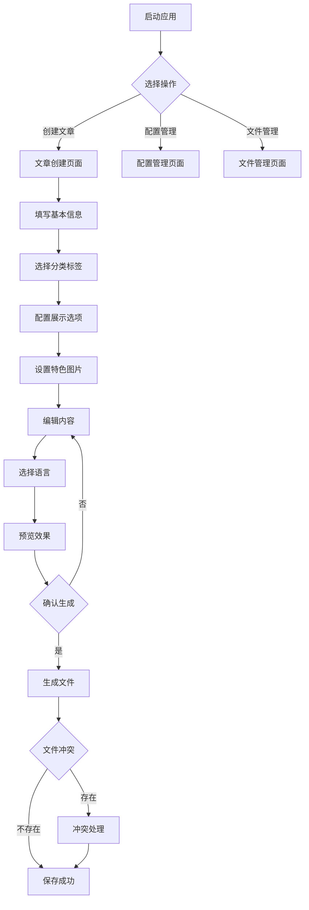

## 1. 产品概述
MD文章meta信息生成器是一款桌面端图形界面工具，用于表单化生成Hugo格式的Markdown文章文件。通过简化内容创建流程，确保字段完整、路径正确、风格一致，降低技术写作门槛。

产品主要面向个人博客作者和内容创作者，提供双语（中文/英文）文章生成功能，生成的文件可直接用于Hugo站点构建。

## 2. 核心功能

### 2.1 用户角色

| 角色  | 注册方法      | 核心权限              |
| --- | --------- | ----------------- |
| 作者  | 本地使用，无需注册 | 填写表单内容，生成文章文件     |
| 维护者 | 本地使用，无需注册 | 配置默认值、路径策略、字段校验规则 |

### 2.2 功能模块
MD文章meta信息生成器包含以下核心页面：

1. **文章创建页面**：表单填写、内容编辑、预览功能
2. **配置管理页面**：默认设置、路径配置、模板管理
3. **文件管理页面**：生成历史、文件操作、冲突处理

### 2.3 页面详情

| 页面名称   | 模块名称  | 功能描述                       |
| ------ | ----- | -------------------------- |
| 文章创建页面 | 基本信息区 | 输入标题、子标题、作者、草稿状态、日期时间      |
| 文章创建页面 | 分类标签区 | 选择标签、分类、系列，支持多选和自定义输入      |
| 文章创建页面 | 展示设置区 | 配置目录开关、图片画廊、分享、评论、数学公式     |
| 文章创建页面 | 资源区   | 设置特色图片和预览图路径               |
| 文章创建页面 | 版权区   | 输入单篇文章许可证（可选）              |
| 文章创建页面 | 内容区   | 编辑摘要和正文，自动插入<!--more-->分隔符 |
| 文章创建页面 | 语言区   | 选择生成中文、英文或双语版本             |
| 文章创建页面 | 预览区   | 实时预览Markdown渲染效果           |
| 配置管理页面 | 默认设置  | 配置作者默认值、开关状态、路径设置          |
| 配置管理页面 | 模板管理  | 查看和更新模板字段映射                |
| 文件管理页面 | 生成历史  | 查看已生成的文件列表和时间              |
| 文件管理页面 | 冲突处理  | 处理文件重名，支持覆盖、重命名、取消         |

## 3. 核心流程

### 作者操作流程

1. 打开应用程序，进入文章创建页面
2. 填写基本信息：标题、子标题、作者、日期
3. 选择分类标签和系列
4. 配置展示选项：目录、画廊、分享等
5. 上传或设置特色图片
6. 编辑摘要和正文内容
7. 选择生成语言版本
8. 预览渲染效果
9. 确认保存路径和文件名
10. 生成文章文件

### 维护者操作流程

1. 进入配置管理页面
2. 设置默认作者、开关状态
3. 配置默认保存路径
4. 更新模板字段映射
5. 保存配置更改

## 4. 用户界面设计

### 4.1 设计风格

* **主色调**：深蓝色（#1e40af）和白色背景，营造专业感

* **按钮样式**：圆角矩形设计，主要操作为实心按钮，次要操作为边框按钮

* **字体选择**：中文使用思源黑体，英文使用Inter字体，确保跨平台一致性

* **布局风格**：卡片式布局，左侧表单区域，右侧预览区域

* **图标风格**：使用简洁的线性图标，保持界面清爽

### 4.2 页面设计概述

| 页面名称   | 模块名称  | UI元素                                        |
| ------ | ----- | ------------------------------------------- |
| 文章创建页面 | 基本信息区 | 标题输入框（大字体）、子标题输入框、作者选择器（下拉+多选）、草稿开关、日期时间选择器 |
| 文章创建页面 | 分类标签区 | 标签输入框（支持自动补全）、分类下拉选择、系列选择器、系列权重输入           |
| 文章创建页面 | 展示设置区 | 目录开关（自动+手动）、图片画廊开关、分享开关、评论开关、数学公式开关         |
| 文章创建页面 | 资源区   | 特色图片上传按钮、预览图路径输入框、图片预览缩略图                   |
| 文章创建页面 | 版权区   | 许可证输入框（占位符显示站点默认版权）                         |
| 文章创建页面 | 内容区   | 摘要文本域（上半部分）、正文编辑器（下半部分，支持Markdown语法高亮）      |
| 文章创建页面 | 语言区   | 中文复选框（默认选中）、英文复选框、双语提示标签                    |
| 文章创建页面 | 预览区   | 标签页切换（摘要/正文/全文）、渲染后的HTML预览、复制按钮             |
| 配置管理页面 | 默认设置  | 表单输入框、开关组件、路径选择器、保存按钮                       |
| 文件管理页面 | 生成历史  | 表格展示文件名、生成时间、操作按钮（打开/删除）                    |

### 4.3 响应式设计
- **桌面优先**：主要面向桌面用户，优化大屏幕体验
- **移动端适配**：支持平板设备，调整布局为上下结构
- **触摸优化**：按钮和输入框适当增加点击区域

### 4.4 界面美化改进（2025年更新）
基于用户反馈，对界面进行了以下美化优化：

**紧凑化改进**：
- 窗口尺寸从900x750调整为850x680，更加适中
- 主框架内边距从15px减少到12px
- 组件间垂直间距统一优化，减少视觉冗余
- 输入框宽度整体调整，提升空间利用率

**交互体验提升**：
- 可折叠框架边距优化，内容区域更加紧凑
- 按钮间距调整，操作区域更加精致
- 文本框高度优化，在保持功能的同时减少空间占用

**整体效果**：
- 界面更加专业精致，信息密度提升
- 保持了现代化的视觉风格
- 用户体验更加流畅，操作效率提升

