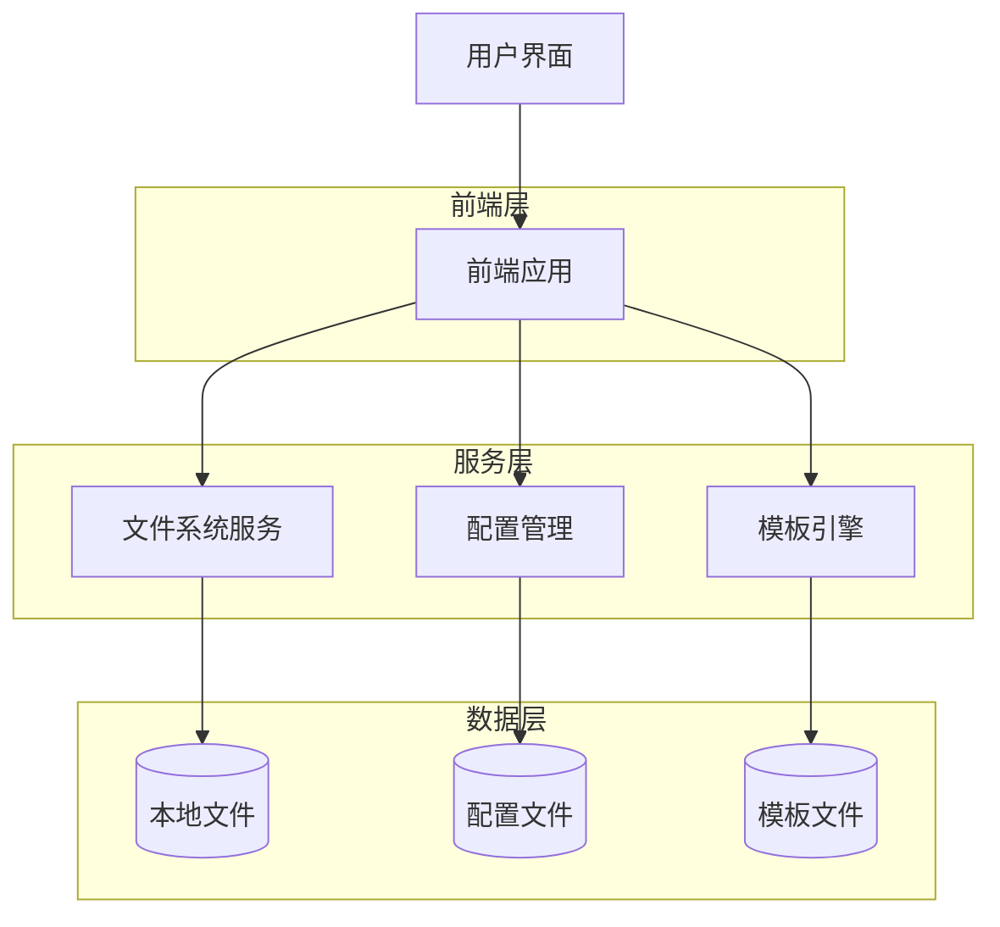
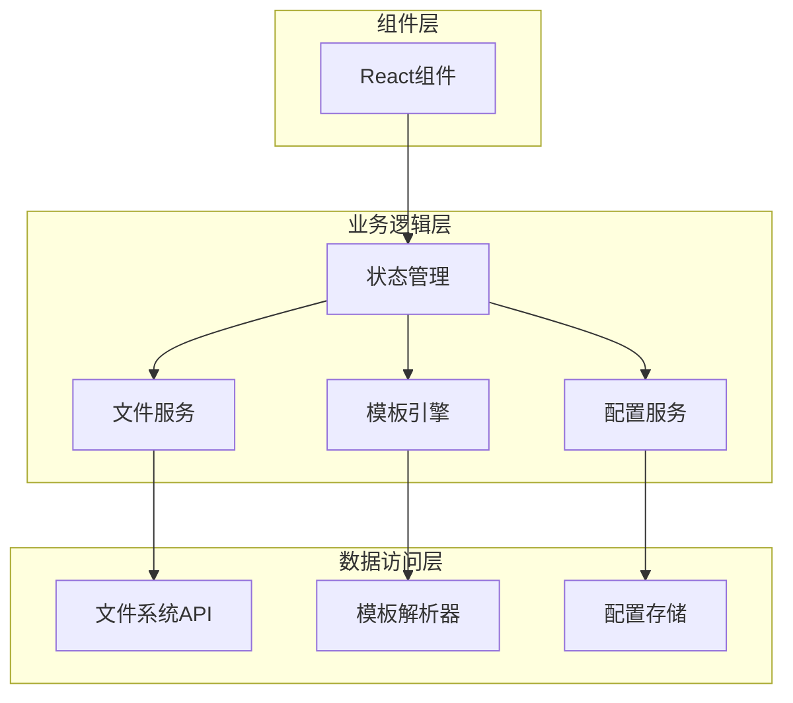
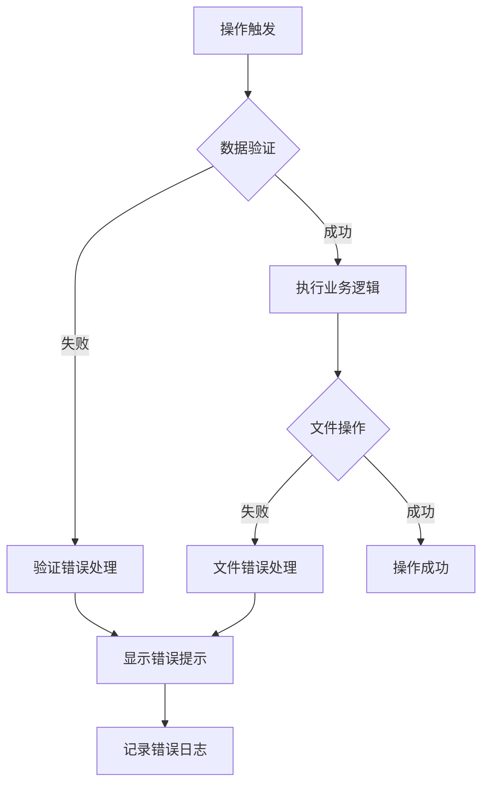

# MD文章meta信息生成器技术架构文档

## 1. 架构设计



## 2. 技术描述

### 前端技术栈
- **框架**: Python Tkinter (桌面应用)
- **UI组件库**: ttk (现代主题组件)
- **样式**: 自定义ttk.Style()主题
- **数据库**: SQLite3 (本地数据存储)
- **Markdown渲染**: 自定义模板引擎
- **图标系统**: Emoji图标 + Unicode符号
- **CI/CD**: GitHub Actions（Windows打包与自动发布）

### 后端服务
- **无后端**: 纯客户端应用，直接操作本地文件系统
- **文件操作**: Python标准库os和path模块
- **数据持久化**: SQLite3数据库用于配置和历史记录存储

### 数据存储
- **本地文件系统**: 直接读写Markdown文件
- **配置文件**: SQLite3数据库存储用户设置和分类数据
- **模板文件**: 本地Markdown模板
- **历史记录**: SQLite3数据库存储生成历史（查询包含 `created_at` 字段）

## 3. 界面架构

### 3.1 主界面结构
- **标签页系统**: 使用ttk.Notebook实现多标签界面
- **文章生成标签**: 主要功能区域，包含表单和预览
- **配置管理标签**: 默认设置和参数配置
- **历史记录标签**: 文件生成历史查看

### 3.2 组件架构
```
主窗口 (Tkinter)
├── 顶部工具栏 (Frame)
│   ├── 操作按钮组 (新建、预览、生成)
│   └── 路径选择组 (输入框 + 浏览按钮 + 悬浮气泡提示)
├── 标签页容器 (Notebook)
│   ├── 文章生成页面
│   │   ├── 基本信息区域 (LabelFrame)
│   │   ├── 分类标签区域 (CollapsibleFrame)
│   │   ├── 展示设置区域 (CollapsibleFrame)
│   │   ├── 高级选项区域 (CollapsibleFrame)
│   │   └── 内容摘要区域 (CollapsibleFrame)
│   ├── 配置管理页面
│   │   ├── 基本配置区域
│   │   ├── 开关配置区域
│   │   └── 操作按钮组
│   └── 历史记录页面
│       ├── 历史表格
│       └── 操作按钮
└── 状态栏 (可选)
└── 分类管理弹窗 (Toplevel)
    ├── 列表 + 输入框
    ├── 添加/删除/刷新按钮
    └── 与下拉框联动（作者/标签/分类）
```

## 4. 数据模型

### 4.1 文章数据模型
```typescript
interface Article {
  // Front Matter 字段
  title: string;
  subtitle?: string;
  date: string;
  lastmod: string;
  draft: boolean;
  authors: string[];
  description: string;
  tags: string[];
  categories: string[];
  featuredImage?: string;
  featuredImagePreview?: string;
  hiddenFromHomePage?: boolean;
  hiddenFromSearch?: boolean;
  toc: {
    enable: boolean;
    auto: boolean;
  };
  lightgallery: boolean;
  share: {
    enable: boolean;
  };
  comment: {
    enable: boolean;
  };
  math: {
    enable: boolean;
  };
  license?: string;
  
  // 内容字段
  summary: string;
  content: string;
  
  // 文件信息
  slug: string;
  language: 'zh-cn' | 'en' | 'both';
  filePath: string;
}
```

### 4.2 配置数据模型
```typescript
interface AppConfig {
  // 默认作者
  defaultAuthors: string[];
  
  // 默认开关状态
  defaults: {
    draft: boolean;
    tocEnable: boolean;
    tocAuto: boolean;
    lightgallery: boolean;
    shareEnable: boolean;
    commentEnable: boolean;
    mathEnable: boolean;
  };
  
  // 路径配置
  paths: {
    postsDir: string;
    templatePath: string;
  };
  
  // 语言配置
  language: {
    defaultLanguage: 'zh-cn' | 'en';
    enableBilingual: boolean;
  };
  
  // 界面配置
  ui: {
    theme: 'light' | 'dark';
    autoSave: boolean;
    autoSaveInterval: number;
  };
}
```

### 4.3 模板数据结构
```typescript
interface TemplateMapping {
  field: string;
  type: 'string' | 'boolean' | 'array' | 'object';
  defaultValue?: any;
  required: boolean;
  mapping: string; // UI字段到模板字段的映射
}
```

## 5. 核心服务架构



## 5. UI样式系统设计

### 5.1 现代化样式配置
```python
MODERN_STYLE = {
    'bg_color': '#f8f9fa',           # 背景色
    'primary_color': '#4a90e2',      # 主色调
    'secondary_color': '#6c757d',    # 次要色
    'success_color': '#28a745',      # 成功色
    'danger_color': '#dc3545',       # 危险色
    'warning_color': '#ffc107',      # 警告色
    'info_color': '#17a2b8',         # 信息色
    'text_color': '#495057',         # 文本色
    'border_color': '#dee2e6',       # 边框色
    'font_family': 'Segoe UI',       # 字体
    'font_size_normal': 10,          # 正文字号
    'font_size_large': 12,           # 大字号
    'border_radius': 8,              # 圆角半径
    'padding': 12,                   # 内边距
}
```

### 5.2 ttk样式定制
- **TFrame**: 现代化背景色和边框
- **TLabel**: 统一字体和颜色配置
- **TButton**: 圆角按钮，悬停效果和颜色变化
- **TEntry**: 边框高亮和焦点效果
- **TCombobox**: 下拉框样式统一
- **TCheckbutton**: 使用✅作为选中图标
- **TNotebook**: 标签页现代化设计
- **TLabelframe**: 分组框卡片式设计

### 5.3 布局优化策略
- **紧凑化设计**: 减少冗余空间，提升信息密度
- **统一间距**: 12px网格系统，保持视觉一致性
- **响应式比例**: 窗口尺寸850x680，适配主流显示器
- **可折叠区域**: 使用CollapsibleFrame优化空间利用

## 6. 文件结构设计

### 6.1 项目结构
```
article-markdown-generator/
├── main.py                  # 主应用程序入口
├── database.py              # SQLite数据库管理
├── requirements.txt         # Python依赖包
├── article_generator.db     # SQLite数据库文件
├── build.ps1                # Windows PowerShell 打包脚本
├── build.bat                # Windows CMD 打包脚本（调用PowerShell重命名）
├── .github/workflows/build.yml  # GitHub Actions 工作流（打包并发布到Release）
├── README.md               # 项目说明文档
└── .trae/
    └── documents/          # 项目文档
        ├── 产品需求文档.md
        └── 技术架构文档.md
```

### 6.2 核心类结构
```python
ArticleMetaGenerator/       # 主应用类
├── setup_modern_styles()  # 现代化样式配置
├── setup_ui()            # 用户界面初始化
├── create_modern_toolbar() # 工具栏创建
├── create_main_content() # 主内容区域
├── create_modern_*_section() # 各功能模块
├── CollapsibleFrame      # 可折叠框架组件
└── DatabaseManager      # 数据库管理类
```

## 7. 界面美化实现细节

### 7.1 现代化样式系统
```python
def setup_modern_styles(self):
    """配置现代化ttk样式"""
    style = ttk.Style()
    
    # 配置颜色方案
    style.configure('Modern.TFrame', 
                   background=MODERN_STYLE['bg_color'])
    
    # 按钮样式 - 圆角、悬停效果
    style.configure('Modern.TButton',
                   background=MODERN_STYLE['primary_color'],
                   foreground='white',
                   borderwidth=0,
                   focusthickness=3,
                   focuscolor='none')
    
    # 复选框样式 - 使用✅图标
    style.configure('Modern.TCheckbutton',
                   background=MODERN_STYLE['bg_color'],
                   foreground=MODERN_STYLE['text_color'])
    
    # 输入框样式 - 边框高亮
    style.configure('Modern.TEntry',
                   fieldbackground='white',
                   bordercolor=MODERN_STYLE['border_color'],
                   lightcolor=MODERN_STYLE['primary_color'])
```

### 7.2 紧凑化布局策略
- **窗口尺寸**: 850x680像素，适配主流显示器
- **网格系统**: 12px基础间距单位
- **组件间距**: 垂直12px，水平6px
- **内边距**: 框架12px，控件内部6px
- **可折叠区域**: 使用CollapsibleFrame实现空间优化

### 7.3 图标系统优化
- **功能图标**: Emoji表情符号，跨平台兼容
- **按钮图标**: Unicode符号，无需外部依赖
- **一致性**: 所有选中状态使用相同图标风格

## 8. 核心算法设计

### 8.1 Slug生成算法
```typescript
function generateSlug(title: string, language: 'zh-cn' | 'en'): string {
  if (language === 'zh-cn') {
    // 中文转拼音
    const pinyin = convertToPinyin(title);
    return pinyin.toLowerCase()
      .replace(/[^a-z0-9]+/g, '-')
      .replace(/^-|-$/g, '');
  } else {
    // 英文处理
    return title.toLowerCase()
      .replace(/[^a-z0-9]+/g, '-')
      .replace(/^-|-$/g, '');
  }
}
```

### 7.2 Front Matter生成算法
```typescript
function generateFrontMatter(article: Article): string {
  const frontMatter = {
    title: article.title,
    subtitle: article.subtitle,
    date: article.date,       // ISO8601(含时区)
    lastmod: article.lastmod, // ISO8601(含时区)
    draft: article.draft,
    authors: article.authors,
    description: article.description,
    tags: article.tags,
    categories: article.categories,
    ...(article.featuredImage && { featuredImage: article.featuredImage }),
    ...(article.featuredImagePreview && { featuredImagePreview: article.featuredImagePreview }),
    hiddenFromHomePage: article.hiddenFromHomePage ?? false,
    hiddenFromSearch: article.hiddenFromSearch ?? false,
    toc: article.toc,
    lightgallery: article.lightgallery,
    share: article.share,
    comment: article.comment,
    math: article.math,
    ...(article.license && { license: article.license })
  };
  
  return `---\n${yaml.stringify(frontMatter)}---\n`;
}
```

## 8. 错误处理设计

### 8.1 错误类型定义
```typescript
enum ErrorType {
  VALIDATION_ERROR = 'VALIDATION_ERROR',
  FILE_SYSTEM_ERROR = 'FILE_SYSTEM_ERROR',
  TEMPLATE_ERROR = 'TEMPLATE_ERROR',
  CONFIG_ERROR = 'CONFIG_ERROR'
}

interface AppError {
  type: ErrorType;
  message: string;
  details?: any;
  timestamp: Date;
}
```

### 8.2 错误处理流程


## 9. 安全设计

### 9.1 路径安全检查
```typescript
function validateFilePath(filePath: string, basePath: string): boolean {
  const resolvedPath = path.resolve(filePath);
  const resolvedBasePath = path.resolve(basePath);
  
  // 检查路径是否在基础路径内
  return resolvedPath.startsWith(resolvedBasePath);
}
```

### 9.2 文件名验证
```typescript
function validateFileName(fileName: string): boolean {
  // 禁止特殊字符
  const invalidChars = /[<>:"|?*\x00-\x1f]/;
  
  // 禁止系统保留字
  const reservedNames = ['CON', 'PRN', 'AUX', 'NUL'];
  
  return !invalidChars.test(fileName) && 
         !reservedNames.includes(fileName.toUpperCase());
}
```

## 10. 性能优化

### 10.1 文件操作优化
- 使用异步文件操作避免阻塞UI
- 实现文件内容缓存减少重复读取
- 批量操作时启用事务机制

### 10.2 渲染优化
- Markdown编辑器使用虚拟滚动处理大文件
- 预览组件实现增量更新
- 表单组件实现字段级更新

### 10.3 内存管理
- 及时清理大文件缓存
- 实现配置文件的懒加载
- 使用WeakMap管理临时数据

## 11. 构建与发布架构

- 流程：Checkout → Setup Python → 安装依赖（PyInstaller/pyyaml）→ PyInstaller打包（`MDMetaGenerator.exe`）→ 上传至 Release。
- 触发：支持标签触发（`vX.Y.Z`）与手动触发（输入版本并校验）。
- 权限：工作流启用 `permissions.contents: write`，确保可创建/更新 Release 并上传资产。
- 下载：在仓库 Releases 页获取 `MDMetaGenerator.exe`。
- 示例仓库：`https://github.com/UnicornUMR1314/unicornumr1314.github.io`（用于发布与下载入口）。
